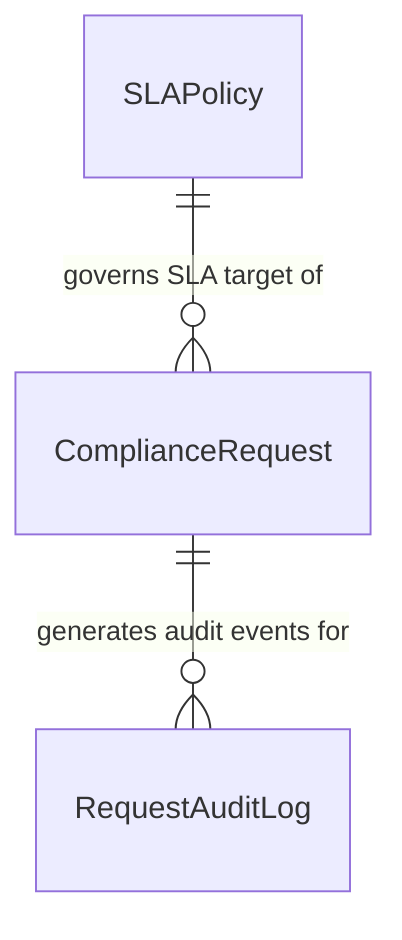

# ComplyFlow Database & SQL Analytics Layer

This directory houses the local relational database and analytical SQL query suite for the ComplyFlow platform.

---

## 1. Why SQLite?

In our Phase 0 environment discovery, dedicated server binaries (`sqlcmd`, `psql`, `docker`) were not installed in the system PATH. SQLite was selected because:
- **Zero Configuration & Serverless:** Requires no database server daemon, background service, or local network port configuration.
- **Built-in to Python:** Python includes full native support via the `sqlite3` standard library module—requiring zero external pip package installations.
- **Portability & Explainability:** The entire database resides in a single, lightweight file (`database/complyflow.db`), making it easy to inspect, backup, and explain during apprentice/junior technical interviews.
- **Full ANSI-SQL Compatibility:** Supports standard SQL joins, common table expressions (CTEs), window functions, aggregate grouping, and views.

---

## 2. Relational Schema & Tables

The database consists of **three core tables**:



1. **`SLAPolicy` (4 Rows):**
   Reference table defining target calendar turnaround hours, warning reminder thresholds, mandatory manager approval flags, and escalation roles by `RiskLevel`.
2. **`ComplianceRequest` (150 Rows):**
   Primary operational transaction table capturing case classification, submitter context, assignment, milestone dates, and approval/escalation metadata.
3. **`RequestAuditLog` (716 Rows):**
   Milestone audit ledger tracking chronological lifecycle transitions (`Created`, `Submitted`, `Assigned`, `Approval Requested`, `Approved`, `Rejected`, `Escalated`, `Closed`).

---

## 3. Data Pipeline: CSV to SQLite

The data pipeline guarantees strict separation between raw storage and relational querying:
```
data/raw/sla_policies.csv         ──> [ database/load_database.py ] ──> SLAPolicy Table
data/raw/compliance_requests.csv  ──> [ database/load_database.py ] ──> ComplianceRequest Table
data/raw/request_audit_log.csv    ──> [ database/load_database.py ] ──> RequestAuditLog Table
                                                                             │
database/queries/analytics_views.sql ────────────────────────────────────────┘
  └── Creates: vw_request_performance, vw_active_backlog, vw_process_area_performance, ...
```

---

## 4. Analytical Views (`database/queries/analytics_views.sql`)

The database includes 5 pre-built analytical views:

| View Name | Scope / Granularity | Key Metrics & Derivations |
| :--- | :--- | :--- |
| **`vw_request_performance`** | One row per case | Derives `ResolutionTimeHours` dynamically for closed cases (`CompletionDateTime - SubmissionDateTime`); returns `NULL` for open cases. |
| **`vw_active_backlog`** | Active cases only (`Status != 'Closed'`) | Evaluates SLA health relative to `2026-09-26 17:00:00`: classifies cases as `Overdue`, `Approaching Deadline`, or `On Track`. |
| **`vw_process_area_performance`** | Aggregated by `ProcessArea` | Summarizes Total Volume, Active Backlog, SLA Breach Rate %, and Average Resolution Time Hours. |
| **`vw_risk_performance`** | Aggregated by `RiskLevel` | Summarizes Volume, SLA Breach %, Approval Mandates, and Cycle Times across risk tiers. |
| **`vw_request_type_performance`** | Aggregated by `RequestType` | Summarizes operational throughput and turnaround times across compliance workflow types. |

---

## 5. Business Questions Answered (`database/queries/business_questions.sql`)

The SQL query suite answers 10 key operational questions:

- **Q1:** Active backlog distribution by `ProcessArea` and `Status`.
- **Q2:** List of active requests currently overdue.
- **Q3:** Active requests currently approaching their deadline within warning thresholds.
- **Q4:** Overall SLA compliance and breach percentages for closed cases.
- **Q5:** Average resolution time and cycle time variance by `ProcessArea`.
- **Q6:** SLA breach percentage variations across risk tiers.
- **Q7:** Turnaround time analysis by `RequestType` (e.g., KYC vs. Sanctions).
- **Q8:** Escalation volume and rate by operational process area.
- **Q9:** Managerial approval workload distribution by risk level.
- **Q10:** Actionable operational queue ordered strictly by urgency (Overdue first $\to$ Risk severity $\to$ Earliest deadline).

---

## 6. How to Rebuild and Verify the Database

### Step 1: Load Database
To create or recreate `database/complyflow.db` and load all raw CSVs:
```powershell
python database/load_database.py
```

### Step 2: Run Automated SQL Verification
To run the automated test harness asserting row counts, foreign-key relationships, and SLA metric math:
```powershell
python database/verify_database.py
```

### Step 3: Run Interactive Queries
You can run any query directly from the terminal using Python:
```powershell
python -c "
import sqlite3
conn = sqlite3.connect('database/complyflow.db')
cursor = conn.cursor()
for row in cursor.execute('SELECT * FROM vw_process_area_performance;'):
    print(row)
"
```
Or execute the executive summary:
```powershell
python -c "
import sqlite3
conn = sqlite3.connect('database/complyflow.db')
with open('database/queries/executive_summary.sql') as f:
    sql = f.read()
cursor = conn.cursor()
print(cursor.execute(sql).fetchone())
"
```
