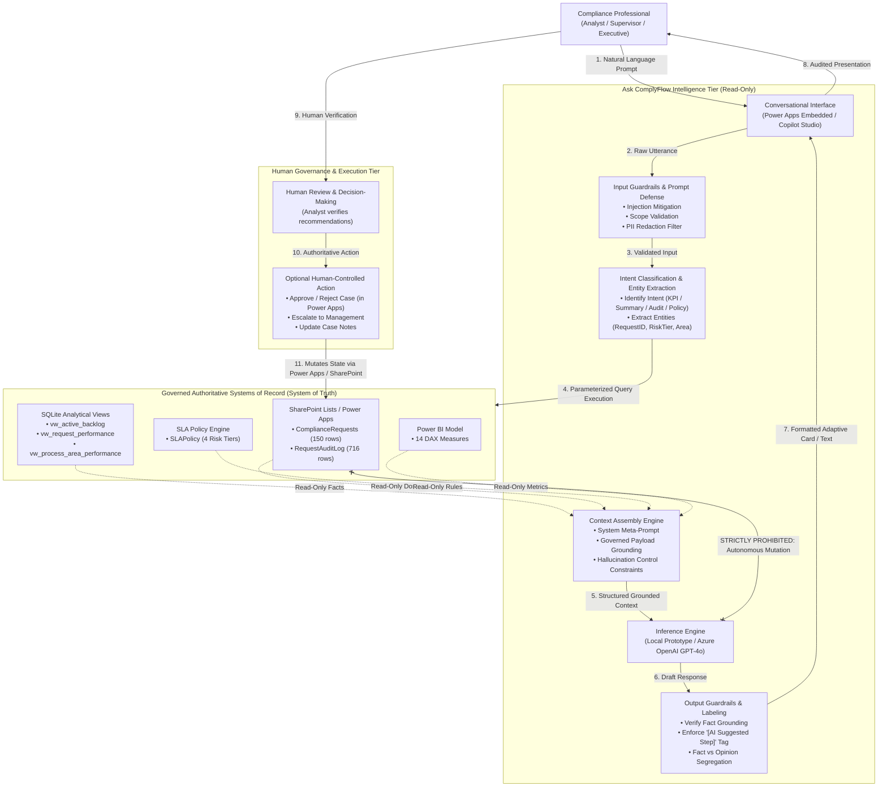

# Ask ComplyFlow — AI Intelligence & Context Data Flow Architecture

**Project:** ComplyFlow — Compliance Workflow & Process Intelligence Platform
**Document:** End-to-End AI Interaction & Retrieval Architecture
**Phase:** 7 Architecture Integration
**Status:** Validated Technical Architecture Specification

---

## 1. End-to-End Interaction & Context Flow

The "Ask ComplyFlow" assistant operates strictly as an analytical and conversational copilot above the operational and analytical layers. It implements a read-only **Retrieval-Augmented Generation (RAG)** pattern where every answer is anchored in governed enterprise records:

---

## 2. Key Architecture Principles

### 2.1 Read-Only Isolation
The AI intelligence layer has **zero write permissions** to any database table, SharePoint list, or audit repository. It cannot create, update, patch, or delete records. All workflow state changes must originate from authenticated human users via the Power Apps interface or Power Automate approvals.

### 2.2 Deterministic Parameterized Retrieval
Rather than passing entire unindexed databases into large language model context windows, "Ask ComplyFlow" executes deterministic, parameterized queries based on extracted entities:
* When a user queries a specific case (`CR-2026-0014`), the system executes a targeted lookup returning only that specific row and its associated audit trail events.
* When querying aggregate KPIs, the system queries curated analytical views (`vw_active_backlog`, `vw_request_performance`) rather than calculating dynamic unverified aggregates on the fly.

### 2.3 Strict Separation of Facts from Hypotheses
Responses are programmatically structured into distinct tiers:
1. **Factual Evidence:** Hard data extracted directly from the system of record.
2. **Descriptive Summary:** Factual translation into clear English.
3. **Operational Recommendation:** Explicitly marked with the tag `[AI Suggested Next Step - Requires Human Verification]`.

---

## 3. Security, Privacy & Boundary Protection

| Security Boundary | Mechanism | Purpose |
| :--- | :--- | :--- |
| **Input Boundary** | Regex Entity Scanners & Prompt Hardening | Prevents prompt injection, jailbreaking, and cross-domain instruction manipulation. |
| **Identity Boundary** | Entra ID Token Pass-Through (Level 3) | Enforces role-based operational permissions; analysts can only inspect cases within their operational division. |
| **Network Boundary** | Azure Private Link & VNet Isolation (Level 3) | Guarantees that internal compliance data never traverses public networks or exposes endpoints externally. |
| **Output Boundary** | Hallucination Interceptor & Watermarking | Detects fabricated entities or unsupported causation and flags recommendations for human oversight. |
