# Architecture Overview

**Project:** ComplyFlow — Compliance Workflow & Process Intelligence Platform
**Document:** System Architecture Specification
**Version:** 1.0 (Phase 1 Baseline)

---

## 1. Planned Architecture Concept

ComplyFlow integrates a low-code business process application stack (Microsoft Power Platform) with an analytical data pipeline (SQL and Python) to provide both operational execution and managerial intelligence.

```mermaid
flowchart TB
    subgraph UI_Layer["User Experience Layer"]
        PA["Power Apps Canvas App\n• Request Intake Form\n• Analyst Work Queue\n• Status Update View"]
    end

    subgraph Store_Layer["Operational Data Store"]
        SP[("SharePoint Online List\n• ComplianceRequests\n• RequestAuditLog\n• RequestCategories")]
    end

    subgraph Logic_Layer["Process Automation Layer"]
        PA -->|Submit / Patch| SP
        SP -->|On Create / Modify| Flow["Power Automate Cloud Flows\n• Notification Dispatch\n• SLA Warning Check\n• Management Escalation"]
    end

    subgraph Local_Analytics["Data Quality & Intelligence Layer (Local / Hybrid)"]
        SP -.->|Data Extract (CSV/JSON/DB)| PyScript["Python Processing Script\n• Schema Validation\n• Data Hygiene & Cleansing\n• SLA Accuracy Auditing"]
        PyScript --> CleanDB[("Relational Database / SQLite\n• Structured Compliance Tables\n• Historical Request Store")]
        CleanDB --> SQLQ["SQL Query Pack\n• SLA Breach Aggregation\n• Dwell-time Bottlenecks\n• Analyst Workload"]
    end

    subgraph Reporting_Layer["Management Insights Layer"]
        SQLQ --> PBI["Power BI Desktop / Service\n• Executive Overview\n• SLA Performance\n• Bottleneck Analysis"]
    end
```

---

## 2. Component Responsibilities

| Component | Architecture Role | Key Responsibilities |
| :--- | :--- | :--- |
| **Microsoft Power Apps** | Interface Tier | Provides a guided, responsive form for submitting compliance requests; validates required fields before submission; provides analysts with a prioritized queue. |
| **SharePoint Online** | Data Tier (Operational) | Serves as the lightweight, structured repository storing live compliance cases, audit timestamps, assignment details, and status flags. |
| **Microsoft Power Automate** | Automation Tier | Executes event-driven background logic: triggers notifications upon submission, evaluates SLA thresholds periodically, and routes high-risk approvals to managers. |
| **Python 3.13** | Data Engineering Tier | Ingests raw case data, performs automated data validation (e.g., verifying date chronological order and required fields), and outputs clean analytical tables. |
| **SQL Engine (SQLite/Relational)** | Analytics Tier | Executes structured analytical queries to calculate core operational compliance metrics: SLA compliance percentage, stage duration, backlog distribution, and analyst throughput. |
| **Microsoft Power BI** | Presentation Tier | Visualizes process intelligence metrics for department leadership, enabling interactive drill-downs into overdue cases, risk categories, and operational delays. |
| **Microsoft Copilot** | AI Productivity Tier | Assists during development with formula construction, documentation generation, and drafting operational request summary templates. |

---

## 3. End-to-End Data Flow

1. **Intake & Metadata Capture:**
   The user inputs request attributes (Request Type, Priority Rationale, Business Unit, Urgency) in Power Apps. The app performs client-side field validation and writes the record to SharePoint Online.
2. **Automated SLA Calculation & Routing:**
   Upon record creation, Power Automate stamps the target completion timestamp (`TargetDueDate`) calculated based on the designated risk tier SLA policy. An assignment alert is dispatched to the relevant analyst team.
3. **Operational Review & Approval:**
   The analyst updates findings in Power Apps. If the request involves High/Critical risk, a Power Automate approval workflow prompts the compliance manager for sign-off.
4. **Data Extraction & Validation:**
   Snapshot operational data is processed through Python data-quality scripts to ensure integrity (no missing dates, valid status transitions, accurate SLA calculation checks).
5. **Relational Analysis:**
   The validated records are loaded into a relational data schema where modular SQL queries calculate SLA breach rates, queue volumes, and analyst cycle times.
6. **Executive Dashboard Consumption:**
   Power BI connects to the curated operational data, rendering dynamic visualizations and KPI summary cards for operational managers.

---

## 4. Local Development vs. Future Cloud Components

A critical design requirement for ComplyFlow is ensuring that technical development, validation, and testing remain fully functional offline before deploying to Microsoft cloud tenants.

```mermaid
graph LR
    subgraph Local_First["Local Environment (Fully Functional Without Cloud Tenant)"]
        L1[Python 3.13 Scripts]
        L2[SQLite Relational Database]
        L3[SQL Analytical Queries]
        L4[Synthetic Compliance Datasets]
        L5[Power BI Desktop Reports]
        L6[Architectural & Workflow Specs]
    end

    subgraph Cloud_Ready["Microsoft Cloud Tenant (Connected in Later Phases)"]
        C1[Power Apps Canvas App]
        C2[SharePoint Online Lists]
        C3[Power Automate Cloud Flows]
        C4[Power BI Service Workspace]
        C5[Microsoft Copilot Assistance]
    end

    Local_First -.->|Deploy / Connect Schema| Cloud_Ready
```



- **Local Development First:** All data schemas, synthetic generators, analytical SQL logic, data quality checks, and Power BI visual templates can be developed and validated locally using standard free tools (Python, SQLite, Power BI Desktop).
- **Future Cloud Integration:** Once access to a Microsoft 365 Developer Tenant is configured, the local schemas directly inform the SharePoint List creation, Power Apps field bindings, and Power Automate flow triggers without redundant engineering.
