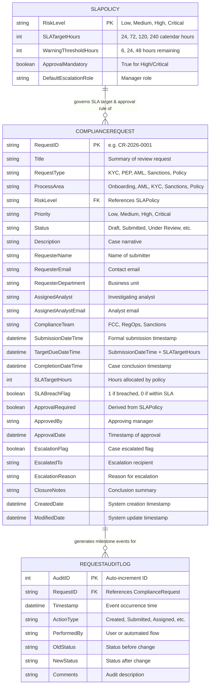
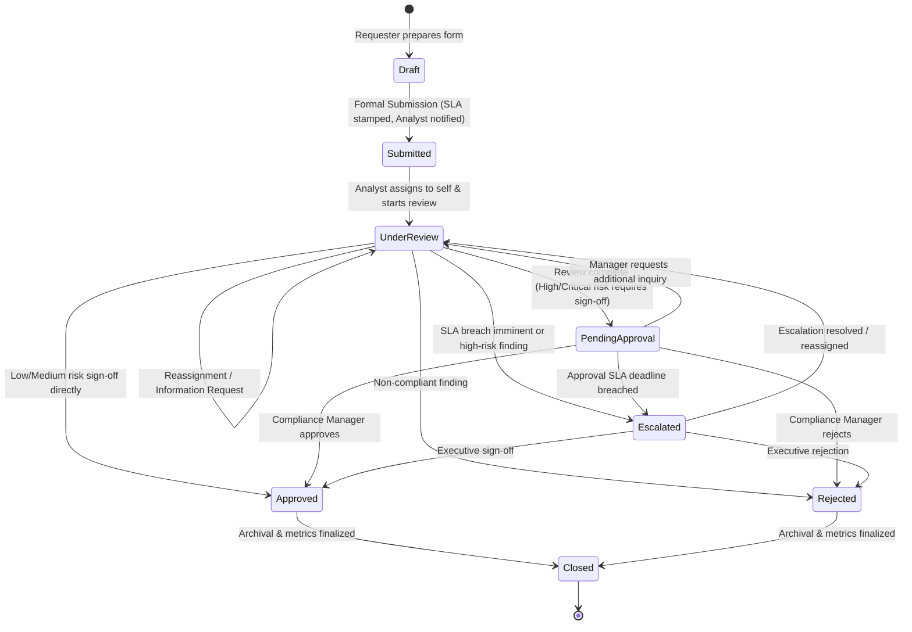
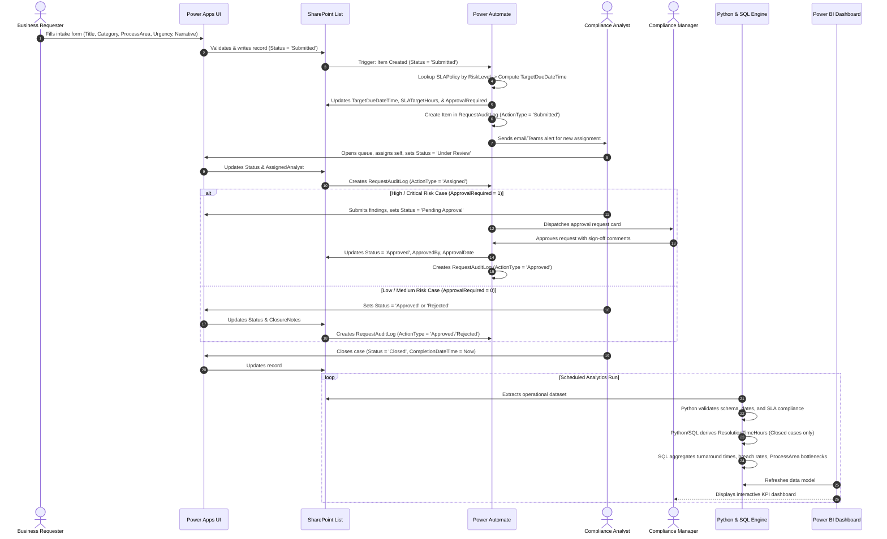

# Domain Model & Entity Relationships

**Project:** ComplyFlow — Compliance Workflow & Process Intelligence Platform
**Document:** Domain Architecture & Entity Relational Mapping
**Phase:** 2A (Refined Design Specification)
**Status:** Approved Baseline for Phase 2B Implementation

---

## 1. Conceptual Entity-Relationship Model

The ComplyFlow domain model couples relational integrity with low-code simplicity.

---

## 2. Request Lifecycle & Allowed State Transitions

The lifecycle guides the compliance request through defined operational stages, preventing arbitrary status updates and ensuring audit integrity:

### Transition Integrity Rules:
1. `Draft` records are pre-submission workspaces and do not incur SLA countdowns or queue dwell-time calculations.
2. A request cannot move to `Under Review` without an `AssignedAnalyst`.
3. High and Critical risk requests **must** pass through `Pending Approval` before moving to `Approved`.
4. Cases can transition to `Escalated` from `Under Review` or `Pending Approval` either manually by the analyst or automatically via Power Automate SLA threshold checks.
5. Once a case reaches `Closed`, its status is immutable.

---

## 3. End-to-End Operational Data Flow

---

## 4. Platform Implementation Mapping

| Domain Concept | Microsoft SharePoint Online | Microsoft Power Apps | Microsoft Power Automate | Local SQL (SQLite) | Python Data Engine | Microsoft Power BI |
| :--- | :--- | :--- | :--- | :--- | :--- | :--- |
| **Record Storage** | Primary List: `ComplianceRequests` | Data Source connection to SharePoint list | Native trigger: *When an item is created or modified* | Table: `compliance_requests` | Ingests CSV/JSON/DB via `pandas` / `sqlite3` | Ingests tables into star schema |
| **Process Area** | Choice Column (5 areas) | Dropdown on intake form & filter tab in queue | Routes to specific team channel based on area | `VARCHAR(50)` with check constraint | Validates against allowed enum set | Dimension slicer for bottleneck analysis |
| **Audit Log** | Secondary List: `RequestAuditLog` | Audit timeline gallery view on Request detail screen | Action: *Create item* in `RequestAuditLog` on 9 milestone events | Table: `request_audit_log` | Computes dwell times between audit timestamps | Linked via `RequestID` for audit drill-down |
| **SLA Targets** | Stamped Date/Time column | Visual countdown badge ("Breach in 4 hrs") | Scheduled flow evaluating `TargetDueDateTime < utcNow()` | Date arithmetic: `(JULIANDAY(TargetDueDateTime) - JULIANDAY(SubmissionDateTime)) * 24` | DateTime delta verification: `(df['TargetDueDateTime'] - df['SubmissionDateTime'])` | KPI Cards: % SLA Met, Overdue Volume |
| **Resolution Time** | *Not stored directly* (avoid manual input errors) | *Not entered by user* | *Not entered by user* | Computed in views: `(JULIANDAY(CompletionDateTime) - JULIANDAY(SubmissionDateTime)) * 24` | Derived column: `(Completion - Submission) / 3600s` | DAX Measure: `AVERAGEX('ComplianceRequests', ...)` |
