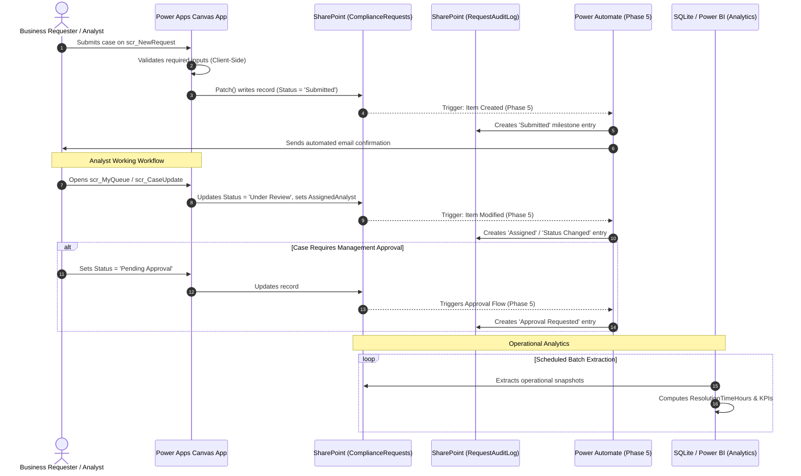

# Power Apps Operational Data Flow

**Project:** ComplyFlow — Compliance Workflow & Process Intelligence Platform
**Document:** Interface Interaction & Multi-Tier Event Flow
**Phase:** 4 Architecture Integration

---

## 1. Architectural Interaction Model

The Power Apps interface acts as the front door for human interaction with the ComplyFlow ecosystem. It directly interacts with SharePoint lists, which in turn trigger automated cloud flows and feed the downstream data engine:

---

## 2. Division of Responsibilities: Power Apps vs. Power Automate

To keep the application lightweight, responsive, and easy to maintain, responsibilities are cleanly bifurcated between the user interface and background orchestration:

| Capability / Function | Managed by Power Apps (UI Tier) | Managed by Power Automate (Automation Tier) |
| :--- | :---: | :---: |
| **Field Completeness Validation** | **Yes** (Client-side alerts before submit) | No (Receives already validated payload) |
| **Immediate User Notification** | **Yes** (UI banners: `Notify(..., Success)`) | No |
| **Personal Queue Slicing** | **Yes** (Delegation filter by `User().Email`) | No |
| **Dynamic SLA State Display** | **Yes** (Calculates Overdue / Approaching on screen) | No |
| **Milestone Audit Log Writing** | No (Read-only gallery display) | **Yes** (Creates official immutable log entries) |
| **Email & Teams Alert Dispatch** | No (Avoids client-side mail limits) | **Yes** (Dispatches notifications via standard connectors) |
| **Manager Approval Card Routing** | No (Status flagged as `Pending Approval`) | **Yes** (Dispatches Teams Adaptive Cards & processes sign-off) |
| **Periodic SLA Warning Checks**| No (Does not run when app is closed) | **Yes** (Recurrence trigger scans for approaching deadlines) |
| **Historical Analytics & DAX** | No | No (Executed in SQLite & Power BI) |

---

## 3. Data Integrity & Concurrency Safeguards

1. **Optimistic Concurrency:** SharePoint maintains an internal `ETag` and `Modified` timestamp on every item. If two analysts attempt to update the same case simultaneously, SharePoint prevents silent overwrites.
2. **Read-Only System Calculations:** Users cannot edit `TargetDueDateTime`, `SLATargetHours`, or `CreatedDate` on the update screen.
3. **Audit Immutability:** The audit log gallery is read-only; no user can manually modify historical audit entries.
