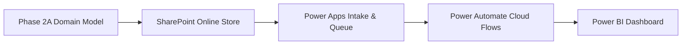

# SharePoint Data & Architecture Mapping

**Project:** ComplyFlow — Compliance Workflow & Process Intelligence Platform
**Document:** End-to-End Platform Data Mapping
**Phase:** 3 Architecture Integration

---

## 1. Multi-Tier Architecture Mapping Overview

This document illustrates how each domain attribute defined in Phase 2A flows from its operational storage in SharePoint Online to downstream user interfaces, workflow automation, and reporting layers:

---

## 2. Comprehensive Attribute Mapping Table

| Domain Field | Domain Data Type | SharePoint Online Column | Future Power Apps Usage | Future Power Automate Usage | Future Power BI Usage |
| :--- | :--- | :--- | :--- | :--- | :--- |
| **`RequestID`** | `VARCHAR(20) PK` | `Request ID` (Single line, unique) | Primary display header in case form & gallery view | Key in item lookups & audit log creation | Drill-down filter & unique distinct case count |
| **`Title`** | `VARCHAR(150)` | `Title` (Single line text) | Input card on submission form | Subject line for email/Teams notifications | Card label in case listings |
| **`RequestType`** | `Choice` | `Request Type` (Choice) | Guided dropdown selector | Branching logic for specialized queue alerts | Categorical bar charts & throughput slicer |
| **`ProcessArea`** | `Choice` | `Process Area` (Choice) | Dropdown selector & gallery filter tab | Team routing variable | Core operational dimension for bottleneck analysis |
| **`RiskLevel`** | `Choice` | `Risk Level` (Choice) | Dropdown with conditional color formatting (Red/Yellow) | Lookup key against `SLAPolicies` list | Risk distribution donut chart & KPI slicer |
| **`Priority`** | `Choice` | `Priority` (Choice) | Urgency selector (defaults to match RiskLevel) | Queue sorting criteria | Priority breakdown chart |
| **`Status`** | `Choice` | `Status` (Choice) | Dynamic status badge & stage stepper | Primary trigger condition (`When Status = ...`) | Lifecycle funnel & active backlog metric |
| **`Description`** | `TEXT` | `Description` (Multiline) | Rich-text input card for case narrative | Included in approval notification body | Tooltip narrative on case drill-through |
| **`RequesterName`** | `VARCHAR(100)` | `Requester Name` (Text) | Auto-filled via `User().FullName` | Greeting name in automated receipts | Filterable requester listing |
| **`RequesterEmail`**| `VARCHAR(150)` | `Requester Email` (Text) | Auto-filled via `User().Email` | Recipient address for notifications | Contact reference |
| **`RequesterDepartment`**| `Choice`| `Requester Department` (Choice) | Business unit dropdown | Department-specific notification routing | Volume breakdown by business division |
| **`AssignedAnalyst`**| `Person/Text` | `Assigned Analyst` (Person) | Queue assignment picker & "My Cases" filter | Target user for assignment alerts | Workload capacity & analyst performance metric |
| **`AssignedAnalystEmail`**| `VARCHAR(150)`| `Assigned Analyst Email` (Text)| Backing property for email dispatch | Send email / Teams assignment card | Analyst identifier |
| **`ComplianceTeam`**| `Choice` | `Compliance Team` (Choice) | Team queue selector | Routes notifications to team shared mailbox | Departmental capacity comparison |
| **`SubmissionDateTime`**| `DATETIME` | `Submission Date Time` (Date/Time)| Locked field; stamped when submitting | Timestamp starting SLA timer | Trendline axis & cycle time calculation |
| **`TargetDueDateTime`**| `DATETIME` | `Target Due Date Time` (Date/Time)| Visual countdown badge ("Due in X hrs") | Evaluated daily/hourly to detect breaches | SLA target milestone & overdue gauge |
| **`CompletionDateTime`**| `DATETIME` | `Completion Date Time` (Date/Time)| Stamped when moving to Closed | Stamped automatically on closure | Basis for deriving `ResolutionTimeHours` |
| **`SLATargetHours`** | `INTEGER` | `SLA Target Hours` (Number) | Displayed target turnaround tag | Duration added to `SubmissionDateTime` | Benchmark target line in visual charts |
| **`SLABreachFlag`** | `BOOLEAN` | `SLA Breach Flag` (Yes/No) | Red alert banner on case screen | Triggers manager escalation flow | Metric: Overall SLA Breach Rate % |
| **`ApprovalRequired`**| `BOOLEAN` | `Approval Required` (Yes/No) | Hides/shows approval section in UI | Condition: if `Yes`, routes to manager | % Cases Requiring Governance Sign-off |
| **`ApprovedBy`** | `Person/Text` | `Approved By` (Person) | Displayed on approved cases | Stamped from approver's M365 profile | Approver accountability log |
| **`ApprovalDate`** | `DATETIME` | `Approval Date` (Date/Time) | Approval timestamp label | Stamped at moment of approval action | Dwell-time calculation for approval stage |
| **`EscalationFlag`** | `BOOLEAN` | `Escalation Flag` (Yes/No) | Visual warning icon on gallery card | Condition: trigger escalation flow | Total Escalated Requests KPI |
| **`EscalatedTo`** | `VARCHAR(100)` | `Escalated To` (Text) | Displayed role/manager | Recipient of escalation notification | Escalation target distribution |
| **`EscalationReason`**| `TEXT` | `Escalation Reason` (Multiline)| Form card for documenting escalation | Included in manager escalation notice | Audit review & risk inquiry |
| **`ClosureNotes`** | `TEXT` | `Closure Notes` (Multiline) | Required input when finalizing review | Documented outcome in audit archive | Audit narrative text |
| **`CreatedDate`** | `DATETIME` | `Created Date` (Date/Time) | System creation metadata | Audit tracking | System audit baseline |
| **`ModifiedDate`** | `DATETIME` | `Modified Date` (Date/Time) | System update metadata | Audit tracking | Queue sorting criteria |

---

## 3. Supporting Lists Mapping

### A. `RequestAuditLog`
- **SharePoint Role:** Secondary event ledger.
- **Power Automate Role:** Receives an automated *Create Item* action whenever `Status`, `AssignedAnalyst`, `ApprovalDate`, or `EscalationFlag` changes in `ComplianceRequests`.
- **Power BI Role:** Enables drill-through event timelines and calculating exact stage dwell time (e.g., hours spent in `Under Review` vs `Pending Approval`).

### B. `SLAPolicies`
- **SharePoint Role:** Reference governance table.
- **Power Apps Role:** Can be cached locally in a collection on app startup to dynamically inform form guidance.
- **Power Automate Role:** Polled upon case submission to look up `SLATargetHours`, `WarningThresholdHours`, and `ApprovalMandatory` based on the selected `RiskLevel`.
- **Power BI Role:** Acts as a dimension table in the star schema.
