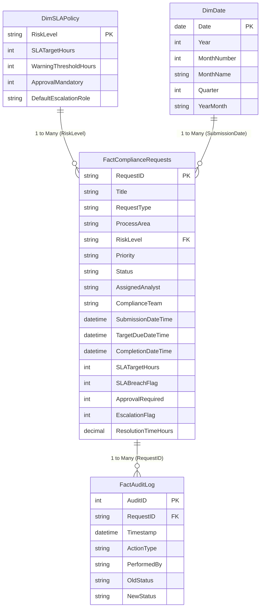

# Power BI Compliance Intelligence & Management Reporting

**Project:** ComplyFlow — Compliance Workflow & Process Intelligence Platform
**Component:** Microsoft Power BI Reporting & Analytics Architecture
**Phase:** 6 (Executive Analytics & DAX Modelling)
**Status:** Implementation Specification & Reference Design (Desktop Build Ready)

---

## 1. Executive Purpose & Business Value

The **ComplyFlow Power BI Reporting Solution** provides compliance leadership, operational managers, and audit committees with an interactive, data-driven window into regulatory request throughput, operational risk distribution, team capacity, and process bottlenecks.

It elevates compliance operations from a reactive, email-based tracker into an **auditable, intelligent, and performance-managed workflow platform**.

### Core Business Questions Answered
1. **Workload Scale:** *How large is our current active compliance backlog across divisions?* (Active = 50 cases)
2. **SLA Adherence:** *What is our historical regulatory breach rate, and how many active cases are currently overdue?* (Historical breach rate = 12.0%, currently overdue = 24 cases)
3. **Operational Bottlenecks:** *Which process areas experience the longest cycle times and highest case dwell time?* (`AML Operations` average cycle time = 80.12h; `KYC Operations` active backlog = 17 cases)
4. **Governance Oversight:** *What volume of high-risk cases requires management sign-off?* (70 cases; 46.7% of all requests)
5. **Operational Triage:** *Which specific overdue cases require immediate managerial intervention?* (Drill-down on Page 4)

```
[ Compliance Staff & Management ]
                │
                ▼
 [ Power BI 4-Page Executive Report ]
   ├── Page 1: Executive Compliance Overview   (Executive Summary & Core KPIs)
   ├── Page 2: Operational Workload            (Volume Distribution by Area & Team)
   ├── Page 3: SLA & Process Performance       (Bottlenecks, Cycle Times, Breach Rates)
   └── Page 4: Case / Operational Detail       (Actionable Drill-Down & Triage Table)
                ▲
                │ (Direct Import / Scheduled Refresh)
 [ Analytical Data Model: Star Schema ]
   ├── Fact: FactComplianceRequests (150 rows) & FactAuditLog (716 rows)
   └── Dim:  DimSLAPolicy, DimDate, DimProcessArea, DimRequestType, DimStatus
                ▲
                │ (Curated Database Layer)
 [ ComplyFlow SQLite Database / Views (complyflow.db) ]
```

> **Live Environment Status:** In accordance with project governance rules, no live Power BI Service workspace or cloud refresh gateway has been deployed. All specifications, star-schema designs, DAX measure catalogs, visual layouts, and manual validation protocols are prepared for immediate manual implementation in **Power BI Desktop**.

---

## 2. Power BI Analytical Data Model (Star Schema)

The analytical data model follows dimensional modeling best practices to ensure optimal performance, clear relationship cardinality, and intuitive DAX authoring:



### Model Assets & Responsibilities
- **`FactComplianceRequests` (150 rows):** Ingested from `vw_request_performance` or `ComplianceRequest`. Contains transaction-level metrics, lifecycle milestones, and pre-derived `ResolutionTimeHours` (NULL for active cases).
- **`FactAuditLog` (716 rows):** Ingested from `RequestAuditLog`. Provides granular milestone timelines for audit inquiries and stage duration analysis.
- **`DimSLAPolicy` (4 rows):** Ingested from `SLAPolicy`. Provides dimensional attributes for SLA target durations, warning thresholds, and escalation pathways.
- **`DimDate`:** Generated dynamically via Power BI DAX (`CALENDARAUTO()`). Connects to `SubmissionDateTime` as the primary active relationship.

---

## 3. Four-Page Report Structure Overview

| Page # | Page Name | Primary Audience | Core Focus |
| :---: | :--- | :--- | :--- |
| **1** | **Executive Compliance Overview** | Head of Compliance / CCO | Rapid assessment: 8 executive KPI cards, volume by process area, risk distribution, and historical SLA compliance. |
| **2** | **Operational Workload** | Compliance Team Leads | Backlog distribution across 5 Process Areas, 3 Teams, and 4 Risk Tiers; active queue capacity balancing. |
| **3** | **SLA & Process Performance** | Operations Managers | Process efficiency: SLA breach rate by area, average cycle times, median dwell time, escalation rates, and approval volume. |
| **4** | **Case / Operational Detail** | Investigating Analysts | Triage grid with conditional formatting highlighting overdue cases, SLA deadlines, risk tags, and drill-through links. |

---

## 4. Key DAX Measures Summary

All calculations are documented in [power-platform/power-bi/dax-measures.md](dax-measures.md). Key verified executive benchmarks include:

| Measure Name | DAX Core Expression | Expected Verified Value | Category |
| :--- | :--- | :---: | :--- |
| **`[Total Requests]`** | `COUNTROWS(FactComplianceRequests)` | **150** | Volume |
| **`[Closed Requests]`** | `CALCULATE([Total Requests], FactComplianceRequests[Status] = "Closed")` | **100** | Volume |
| **`[Active Backlog]`** | `CALCULATE([Total Requests], FactComplianceRequests[Status] <> "Closed")` | **50** | Volume |
| **`[Overdue Active Cases]`** | `CALCULATE([Active Backlog], FactComplianceRequests[TargetDueDateTime] < DATE(2026,9,26) + TIME(17,0,0))` | **24** | SLA Health |
| **`[Approaching Deadline Cases]`**| `CALCULATE([Active Backlog], ... within WarningThresholdHours)` | **0** | SLA Health |
| **`[On Track Active Cases]`** | `[Active Backlog] - [Overdue Active Cases] - [Approaching Deadline Cases]` | **26** | SLA Health |
| **`[Historical SLA Breach Rate]`**| `DIVIDE([SLA Breached Cases], [Closed Requests], 0)` | **12.0%** | SLA Adherence |
| **`[Average Resolution Time]`** | `AVERAGEX(FILTER(FactComplianceRequests, [Status] = "Closed"), [ResolutionTimeHours])` | **69.27 hrs** | Performance |
| **`[Median Resolution Time]`** | `MEDIANX(FILTER(FactComplianceRequests, [Status] = "Closed"), [ResolutionTimeHours])` | **44.79 hrs** | Performance |
| **`[Escalated Cases]`** | `CALCULATE([Total Requests], FactComplianceRequests[EscalationFlag] = 1)` | **17** | Governance |
| **`[Approval Required Cases]`** | `CALCULATE([Total Requests], FactComplianceRequests[ApprovalRequired] = 1)` | **70** | Governance |

---

## 5. SQL & Analytics Alignment (Data Governance)

To maintain absolute data integrity and prevent independent report authors from inventing divergent logic, Power BI metrics map directly back to the verified Phase 2C SQL analytical layer:

| Power BI Measure | Underlying SQL Source / View | Governing Business Logic |
| :--- | :--- | :--- |
| `[Active Backlog]` | `vw_active_backlog` | `WHERE Status <> 'Closed'` |
| `[Overdue Active Cases]` | `vw_active_backlog` | `WHERE Status <> 'Closed' AND '2026-09-26 17:00:00' > TargetDueDateTime` |
| `[SLA Breach Rate]` | `vw_process_area_performance` | `SUM(ClosedBreached) / SUM(ClosedTotal)` |
| `[Average Resolution Time]`| `vw_process_area_performance` | `AVG((JULIANDAY(Completion) - JULIANDAY(Submission)) * 24.0)` |
| `[ResolutionTimeHours]` | `vw_request_performance` | Derived dynamically on closed records; strictly `NULL` for active cases. |

---

## 6. Refresh Strategy & Production Considerations

1. **Local Development (Current Baseline):**
   - Connects to `database/complyflow.db` via SQLite ODBC Driver or local Python data extract script.
   - Preserves fixed simulation timestamp (`2026-09-26 17:00:00`) for 100% reproducible validation.
2. **Future Cloud Production Scenario:**
   - **Data Source:** Connects directly to SharePoint Online lists (`ComplianceRequests`, `RequestAuditLog`, `SLAPolicies`) via standard OData/SharePoint connector.
   - **SLA Clock:** In a live deployment, replace the fixed anchor with `NOW()` / `TODAY()` in UTC with regional business hour adjustment.
   - **Refresh Frequency:** Scheduled cloud refresh (4–8 times daily) in Power BI Service without requiring on-premises data gateways.
